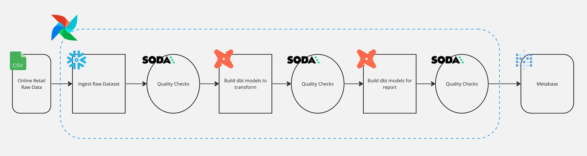
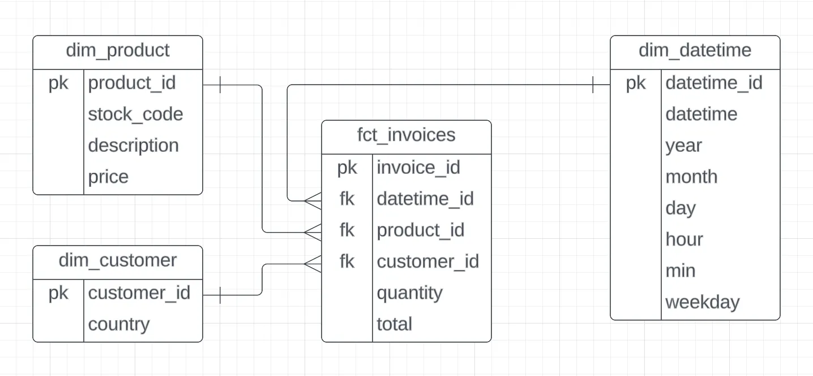
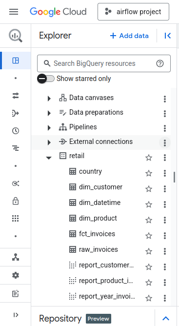

# 🚀 Retail Project: End-to-End Data Pipeline for Quality and Insights  

Welcome to the **Retail Project**, my data project that builds an end-to-end pipeline for extracting, transforming, and loading retail data while ensuring data quality standards are consistently met. This project showcases expertise in data engineering, quality assurance, transformation logic, and reporting, making it the perfect way to demonstrate practical proficiency in modern data pipelines to recruiters.

---

## 📂 Dataset  

We utilize the **Online Retail** dataset from Kaggle, a transactional dataset reflecting sales between December 1, 2010, and December 9, 2011.  

### Dataset Link:  
[Online Retail Dataset](https://www.kaggle.com/datasets/tunguz/online-retail)  

### Dataset Features:  

| Column           | Description                                                                 |
|-------------------|-----------------------------------------------------------------------------|
| **InvoiceNo**     | Unique 6-digit integral number assigned to each transaction.               |
| **StockCode**     | Product code uniquely identifying distinct products.                       |
| **Description**   | Name of the product.                                                      |
| **Quantity**      | Number of units sold per transaction.                                      |
| **InvoiceDate**   | Date and time of the transaction.                                          |
| **UnitPrice**     | Unit price of the product in sterling.                                     |
| **CustomerID**    | Unique customer identifier.                                                |
| **Country**       | Customer's country of residence.                                           |

---

## 🛠️ Pipeline Overview  

Our Airflow pipeline is designed to extract the dataset, load it into Google Cloud Storage (GCS), transform it using dbt (data build tool), enforce data quality checks with Soda Core, and generate actionable reports.  

### Architecture Diagram:



---

## 🏗️ Data Modeling  

The data modeling process transforms raw data into a star schema with well-defined dimension and fact tables. Here's the high-level structure:  


### Tables:  

- **Dimension Tables:**
  - `dim_customer` - Customer details with their country information.
  - `dim_product` - Product information including unique codes and descriptions.
  - `dim_datetime` - Temporal details (year, month, weekday, etc.).

- **Fact Table:**
  - `fct_invoices` - Detailed transactional information linking dimensions.

---

## 🚀 Steps to Run the Pipeline  

### 🌟 Prerequisites  

Make sure you have the following installed:  

- **Docker**  
- **Astro CLI**  
- **Soda Core**  
- **Google Cloud Account**  

---

### 🔧 Development Steps  

Follow these steps to create and deploy the pipeline:

1. **Download Dataset**:
   - Obtain the dataset from [Kaggle](https://www.kaggle.com/datasets/tunguz/online-retail) and store it in `include/dataset/online_retail.csv`.

2. **Google Cloud Configuration**:
   - Create a **Google Cloud Storage (GCS)** bucket.
   - Generate a **service account key** for Airflow to interact with GCS and BigQuery.

3. **Airflow Pipeline**:
   - Design an Airflow DAG to upload the CSV to GCS and load raw data into BigQuery.

4. **Data Quality Checks**:
   - Install **Soda Core** and configure checks for data schema validation using YAML files.

5. **Transformation**:
   - Build **dbt models** to produce dimension and fact tables for analytical insights.

6. **Reporting**:
   - Generate visual summaries and reporting queries with dbt.

7. **Dashboard**:
   - Deploy a **Metabase** container for visualizing reports and sharing insights.

8. **Test and Verify**:
   - Use Soda and Astro CLI to ensure the pipeline executes flawlessly.

---

## 👨‍💻 Tools and Technologies  

- **Apache Airflow**: Orchestration of pipeline steps.  
- **Google Cloud Storage/BigQuery**: Data hosting and querying at scale.  
- **Soda Core**: Automated data quality tests to ensure accuracy.  
- **dbt**: Transformation and modeling for star schema creation.  
- **Metabase**: Data visualization platform for dashboards and insights.  
- **Astro CLI**: Local airflow development and deployment.  

---

## 🎯 Reports  

We generate actionable reports to derive insights from the data:  

1. **Top Customer Invoices by Country**
   - Analyze revenue and invoices per country.  

2. **Best-Selling Products**  
   - Understand the top-selling products and their descriptions.  

3. **Revenue Trends Over Time**  
   - Monitor monthly revenue trends.  

### Sample SQL Reports  

Here's an example of the reporting logic implemented in dbt:

```sql
-- report_customer_invoices.sql
SELECT
  c.country,
  c.iso,
  COUNT(fi.invoice_id) AS total_invoices,
  SUM(fi.total) AS total_revenue
FROM {{ ref('fct_invoices') }} fi
JOIN {{ ref('dim_customer') }} c ON fi.customer_id = c.customer_id
GROUP BY c.country, c.iso
ORDER BY total_revenue DESC
LIMIT 10;
```
# 🎨 Dashboard  

Set up **Metabase** for simple and powerful dashboarding.  

### Deployment Configuration  

```yaml
# docker-compose.override.yml
version: "3.1"
services:
  metabase:
    image: metabase/metabase:v0.46.6.4
    volumes:
      - ./include/metabase-data:/metabase-data
    environment:
      - MB_DB_FILE=/metabase-data/metabase.db
    ports:
      - 3000:3000
    restart: always
```
### Access:
- Metabase UI available at: http://localhost:3000
## 💼 Real-Life Impact
This project is highly relevant for modern businesses in retail and e-commerce. It demonstrates technical proficiency in handling large-scale data pipelines, ensures data integrity, and extracts meaningful insights from raw data.

## ✨ Features Highlight
- ETL Orchestration via Airflow
- Data Warehousing and Quality Validation with GCS, BigQuery, and Soda Core.
- Transformations using dbt with Cosmos integration
- Dashboarding for Visualization with Metabase.

